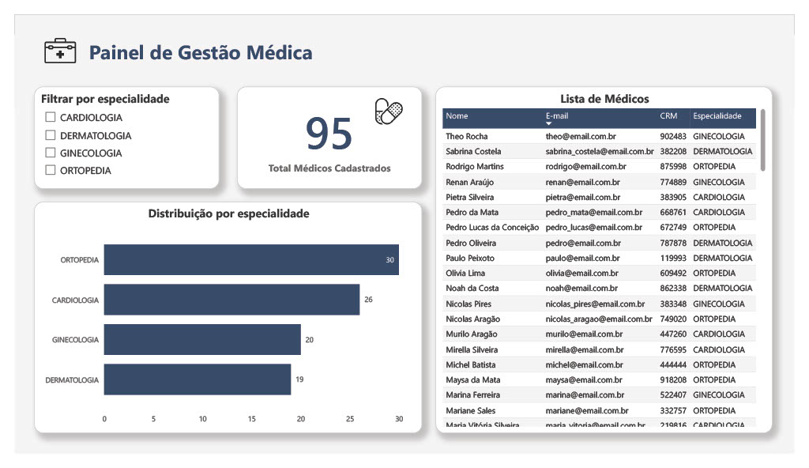

# Painel de Gestão Médica

  

## Objetivo

Desenvolver um dashboard analítico para apoiar a gestão e o monitoramento da base de médicos por especialidade, permitindo visão consolidada e segmentada das informações.

## Contexto de Negócio

A ausência de visualização estruturada dificulta o acompanhamento da distribuição de profissionais, podendo impactar planejamento operacional, alocação de recursos e equilíbrio entre especialidades.

## Solução

Foi desenvolvido um painel interativo no Power BI com integração via API e tratamento dos dados em Linguagem M, estruturando as informações para análise gerencial.

O dashboard permite:

- Visualização do total de médicos cadastrados  
- Análise da distribuição por especialidade  
- Filtros dinâmicos para segmentação  
- Consulta detalhada da base de profissionais  

## Tecnologias

- Power BI  
- Linguagem M (Power Query)  
- API REST  

## Resultado

Disponibilização de uma visão clara e estruturada da base médica, apoiando decisões estratégicas relacionadas a dimensionamento, cobertura de especialidades e gestão operacional.
